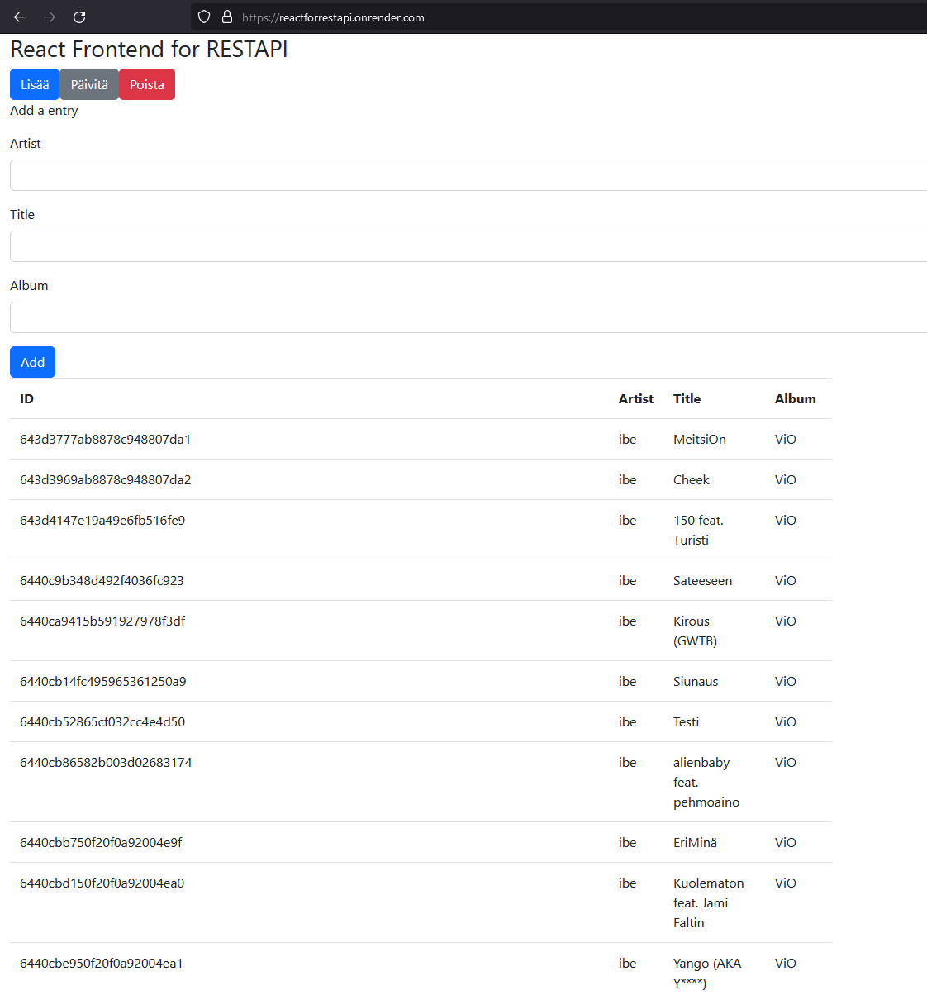

## REACT FOR RESTAPI

Frontend: react  
Backend: node.js  
CSS: Bootstrap  
API URL using mongodb: https://nodejssecond.onrender.com  
  
SITE URL:https://reactforrestapi.onrender.com  
  

Screenshot of the website live on render.  

